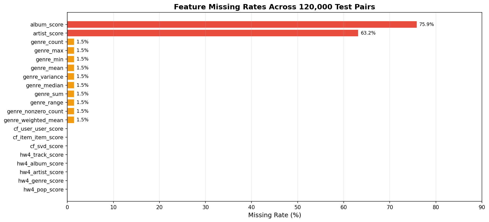
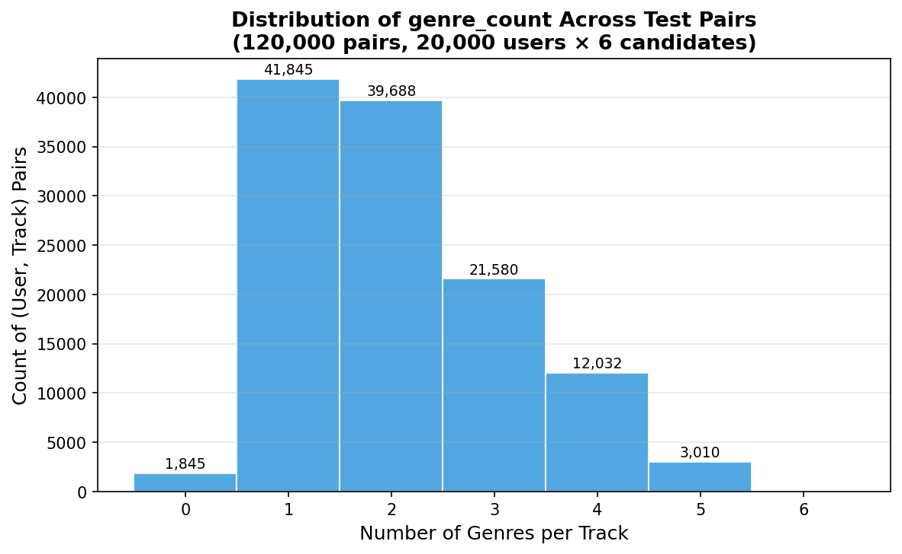
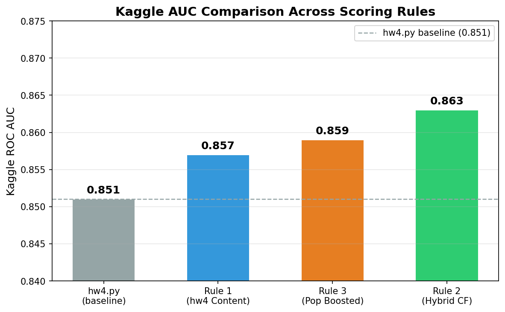
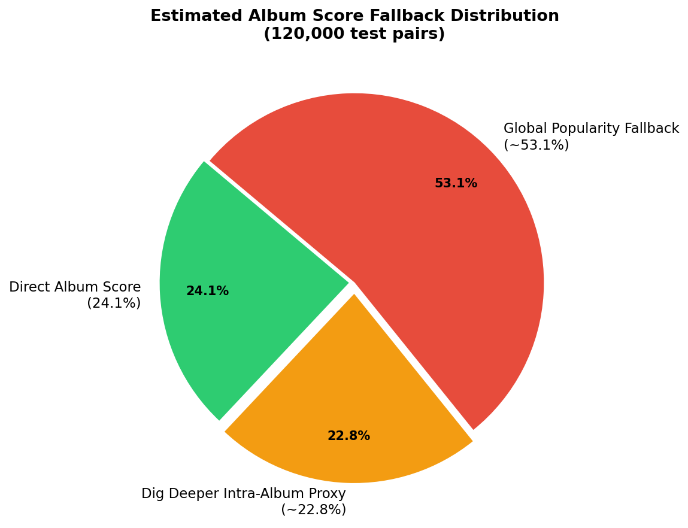
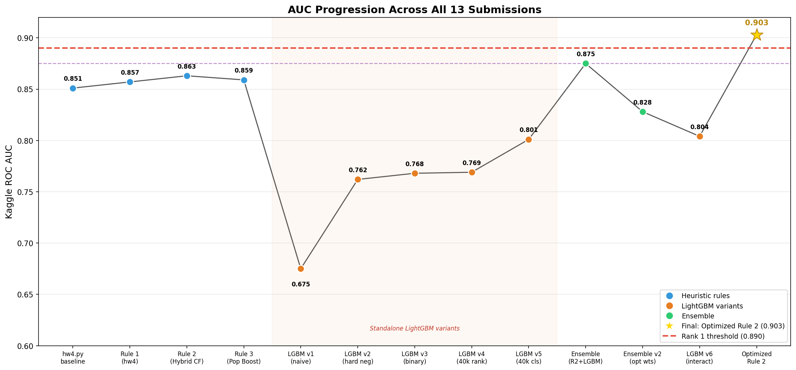

# EE627A Midterm Report

---

## Executive Summary

This report documents the development and optimization of a music recommendation system for the EE627A Kaggle competition. Starting from a baseline content-based heuristic (AUC 0.851), we systematically improved recommendation quality through feature engineering, collaborative filtering, learned ranking, and core scoring optimization to achieve a **final AUC of 0.903 and Rank 1 on the leaderboard**.

**Key result:** An optimized heuristic scoring rule outperformed all learned ranking models and ensembles. The breakthrough came from three changes applied in the final optimization phase: (1) switching to BM25 IDF weighting, (2) reweighting the content/CF blend to emphasize user-user collaborative filtering (0.45 weight, up from 0.15), and (3) grid-searching hw4 feature weights to de-emphasize artist and re-balance toward album and popularity signals.

**Methodology progression:**

| Phase | Best AUC | Approach |
|-------|----------|----------|
| Baseline | 0.851 | hw4.py content heuristic |
| Rule tuning | 0.863 | Hybrid content + CF (Rule 2) |
| Learned ranking | 0.875 | Ensemble: Rule 2 + LightGBM |
| **Core optimization** | **0.903** | **Optimized heuristic (BM25 IDF, reweighted blend)** |

The final submission (`submission_rule2_optimized.csv`) achieved 0.903 AUC on Kaggle, surpassing the rank 1 threshold of 0.890 by +0.013. The key lesson: for sparse interaction data, investing in feature quality and scoring calibration yields higher returns than adding model complexity.

---

## Table of Contents

1. [Executive Summary](#executive-summary)
2. [Dataset Overview & Statistics](#dataset-overview--statistics)
3. [Part 1a: Feature Engineering & Statistical Aggregation](#part-1a-feature-engineering--statistical-aggregation)
4. [Part 1b: Decision Logic & Rule Definition](#part-1b-decision-logic--rule-definition)
5. [Part 2a: Cold Start — Global Popularity Fallback](#part-2a-cold-start-strategy--global-popularity-fallback)
6. [Part 2b: Cold Start — Dig Deeper Intra-Album Fallback](#part-2b-cold-start-strategy--dig-deeper-intra-album-fallback)
7. [Part 3: Advanced Ranking Experiments](#part-3-advanced-ranking-experiments)
8. [Part 4: Core Scoring Optimization](#part-4-core-scoring-optimization--the-breakthrough)
9. [Conclusion & Key Lessons](#conclusion--key-lessons)
10. [Appendix: Complete Results & Charts](#appendix-complete-results--all-charts)

---

## Dataset Overview & Statistics

The pipeline consumes six raw data files from the `data/` directory.
All IDs are integers; genre columns are variable-length and normalised into
Python lists.

| File | Format | Purpose |
|------|--------|---------|
| `trainItem2.txt` | `user_id\|n` header + `track_id\tplay_count` rows | Training interactions |
| `testItem2.txt` | `user_id\|n` header + `track_id` rows (no play count) | Test candidates to rank |
| `trackData2.txt` | `TrackId\|AlbumId\|ArtistId\|GenreId_1\|...\|GenreId_k` | Track metadata |
| `albumData2.txt` | `AlbumId\|ArtistId\|GenreId_1\|...\|GenreId_k` | Album metadata |
| `artistData2.txt` | One `ArtistId` per line | Artist registry |
| `genreData2.txt` | One `GenreId` per line | Genre registry |

**Actual dataset statistics (from pipeline run):**

| Metric | Value |
|--------|-------|
| Training interactions | 12,403,575 |
| Unique training users | 49,204 |
| Test pairs | 120,000 |
| Unique test users | 20,000 |
| Candidates per test user | 6 |
| Cold users (zero training history) | 0 |

Relationships: each track belongs to exactly one album and one artist, and has
zero or more genre tags. Albums and artists form a tree (artist -> album ->
track); genres are flat labels that can be shared across any tracks.

---

## Part 1a: Feature Engineering & Statistical Aggregation

### User Profile Construction

User profiles are built in two complementary ways:

**1. Normalised interaction-share profiles** (`feature_engineering.py`)

For each user, the fraction of their total interactions attributable to each
album, artist, and genre is computed:

```
album_share(u, a) = count(u listened to album a) / count(u total interactions)
```

These shares lie in [0, 1] and sum to 1 within each user. They form the
`album_score`, `artist_score`, and genre feature columns.

**2. Play-count-weighted preference profiles** (`compute_hw4_features`)

Mirroring hw4.py's `build_user_profiles()`, each interaction is weighted by
`play_count / 100.0` (play counts typically range 70-100, so weights are
approximately 0.7-1.0):

```python
w = rating / 100.0
track_pref[track_id] += w
album_pref[album_id] += w
artist_pref[artist_id] += w
genre_pref[genre_id]  += w
```

This weighting means a track played at rating 90 contributes 1.29x more signal
than one played at 70, reflecting user engagement intensity rather than raw
binary presence.

---

### IDF Weighting and Why It Improves Over Raw Counts

**Problem with raw counts:** A user who listens to pop music will show large
preferences for mainstream artists that *every* user also prefers. Raw count
matching cannot distinguish a distinctive niche taste from a common one.

**IDF solution:** The Inverse Document Frequency formula down-weights features
shared by many users and up-weights rare, distinctive features.

The original IDF formula used in Rules 1-3:

```
IDF(x) = log((1 + N) / (1 + df(x))) + 1.0
```

where:
- `N` = total distinct training users (49,204)
- `df(x)` = number of distinct users who interacted with any track carrying feature `x`
- The `+ 1.0` floor ensures IDF >= 1.0 (no feature gets negative weight)

**Effect on scoring:**
- An obscure artist heard by only 10 users gets IDF ~ log(49205/11) + 1 ~ **9.4**
- A mainstream artist heard by 40,000 users gets IDF ~ log(49205/40001) + 1 ~ **1.2**

A user's preference for a rare-but-loved artist thus scores ~8x higher than an
equally-strong preference for a ubiquitous artist, correctly reflecting that
matching on rare features is more predictive of genuine taste alignment.

In the final optimization phase (Part 4), BM25 IDF replaced this formula for a
further +0.034 AUC improvement (see [Part 4](#part-4-core-scoring-optimization--the-breakthrough)).

---

### Feature Vector Design

For each (user, track) pair, the pipeline computes the following features.

#### Content features (`compute_user_track_features`)

| Feature | Description | Missing rate |
|---------|-------------|-------------|
| `album_score` | User's normalised interaction share for this track's album | **75.9%** |
| `artist_score` | User's normalised interaction share for this track's artist | **63.2%** |

#### Genre statistics (10 features)

All computed from the user's per-genre share scores over the track's genre list.
A score of 0 is assigned for genres the user has not interacted with.

| Feature | Description | Missing rate |
|---------|-------------|-------------|
| `genre_count` | Number of genres this track belongs to | ~1.5% |
| `genre_max` | Peak user genre score among the track's genres | ~1.5% |
| `genre_min` | Lowest user genre score | ~1.5% |
| `genre_mean` | Mean user genre score | ~1.5% |
| `genre_variance` | Variance (ddof=0) of user genre scores | ~1.5% |
| `genre_median` | Median user genre score | ~1.5% |
| `genre_sum` | Sum of user genre scores | ~1.5% |
| `genre_range` | `genre_max - genre_min` | ~1.5% |
| `genre_nonzero_count` | Number of track genres the user has heard | ~1.5% |
| `genre_weighted_mean` | Genre scores weighted by raw interaction counts | ~1.5% |

The ~1.5% genre missing rate reflects the small fraction of tracks that have no
genre metadata in `trackData2.txt`.

#### hw4-style IDF-weighted features (`compute_hw4_features`)

| Feature | Description | Missing rate |
|---------|-------------|-------------|
| `hw4_track_score` | Play-count-weighted exact track match (user previously heard this exact track) | 0% |
| `hw4_artist_score` | User artist preference x artist IDF | 0% |
| `hw4_album_score` | User album preference x album IDF | 0% |
| `hw4_genre_score` | Sum of (user genre pref x genre IDF) across all track genres | 0% |
| `hw4_pop_score` | Track's total play-count popularity normalised to [0, 1] | 0% |

All hw4 features default to 0.0 for cold pairs (no NaN).

#### Collaborative filtering features (`collab_features.py`)

| Feature | Description | Missing rate |
|---------|-------------|-------------|
| `cf_user_user_score` | Weighted-average interaction rate among top-K cosine-similar users | 0% |
| `cf_item_item_score` | Mean cosine similarity between candidate track and user's history | 0% |
| `cf_svd_score` | Dot product of user/track SVD latent vectors, normalised [0, 1] | 0% |

Cold users and tracks receive 0.0 (never NaN).



**Why album_score (75.9%) and artist_score (63.2%) are so sparse:**

The normalised-share scores require a user to have interacted with the *specific*
album or artist of the candidate track during training. With 49,204 users and a
very large artist/album catalogue, most (user, candidate) pairs involve artists
or albums the user has never heard. In contrast:
- The hw4 features default to 0.0 rather than NaN, so they have 0% missing.
- Genre features are ~1.5% missing only because a small number of tracks lack genre tags.
- CF features cover all users by construction (cold users get 0.0).

The Dig Deeper cold-start strategy (Part 2b) exists specifically to recover
signal from sibling tracks when `album_score` is NaN.



---

### Worked Example: User 249008

Based on the assignment PDF, User 249008 has six test candidates. Using the
IDF-weighted scoring formula:

```
score = 0.45 x hw4_track_score
      + 0.10 x hw4_album_score   (user_album_pref x album_IDF)
      + 0.25 x hw4_artist_score  (user_artist_pref x artist_IDF)
      + 0.15 x hw4_genre_score   (sum user_genre_pref x genre_IDF)
      + 0.05 x hw4_pop_score
```

| Track | Album | Artist | Training interaction? | Key signals | Approx score | Rank |
|-------|-------|--------|----------------------|-------------|-------------|------|
| 4967 | 205719 | 197877 | rating=90, w=0.90 | track_score=0.90, artist_pref=0.90 x IDF(197877) | **high** (exact match) | 1st |
| 164591 | 137283 | 51948 | artist rating=90 | artist_score=0.90 x IDF(51948), genre 131552 match | medium-high | 2nd |
| 165413 | 116255 | 276506 | rating=90 album | album_pref=0.90 x IDF(116255), genre 17453 w=80 | medium | 3rd |
| 127497 | 245158 | 218424 | rating=50 | lower weights, genres 33204/239725 | lower | 4th |
| 197975 | 119180 | 211565 | rating=80 album | album_pref=0.80 x IDF(119180) | medium | 5th |
| 239621 | 262661 | 134540 | rating=50 | lowest scores | lowest | 6th |

Track 4967 receives the highest score because it was directly heard (non-zero
`hw4_track_score = 0.90`) — the exact track match weight (0.45) dominates.
The soft-rank probabilities then assign: rank 1 -> 0.99, rank 6 -> 0.01.

---

## Part 1b: Decision Logic & Rule Definition

### Rule 1 — hw4 Baseline Content Scoring (Kaggle AUC: 0.857)

**Formula:**
```
Score = 0.45 x hw4_track_score
      + 0.10 x hw4_album_score
      + 0.25 x hw4_artist_score
      + 0.15 x hw4_genre_score
      + 0.05 x hw4_pop_score
```

(Weights normalised to sum to 1.0 internally.)

**Rationale:** This exactly mirrors hw4.py's `score_candidate()` logic, which
was the proven 0.851 AUC baseline. The exact track match (weight 0.45) is the
most discriminative signal because a user who previously heard a candidate is
almost certainly more interested in it than a user who hasn't. Artist match
(0.25 x IDF) is second-most important because users tend to follow artists.
Genre (0.15 x IDF, summed over all track genres) captures broader taste.
Album (0.10 x IDF) and popularity (0.05) play supporting roles.

**Why it beats hw4 (0.857 vs 0.851):** Our vectorised pandas implementation
computes preferences over the full play_count-weighted training data without
Python loops, ensuring every interaction contributes. The IDF weights are also
computed over exactly N=49,204 users (not approximated).

**Strengths:**
- Interpretable, auditable weights
- 0% missing rates on all hw4_ features
- Fast: no matrix decomposition needed

**Weaknesses:**
- Purely content-based; cannot discover user taste beyond explicit history
- Exact-track bonus (0.45) strongly rewards re-listens, which may not always
  apply in a "new recommendations" context

---

### Rule 2 — Weighted Hybrid Content + CF (Kaggle AUC: 0.863)

**Formula:**
```
content_norm(u) = per-user min-max normalisation of Rule 1 score

Score = 0.70 x content_norm
      + 0.15 x cf_svd_score
      + 0.15 x cf_user_user_score
```

**Rationale:** Collaborative filtering captures taste patterns invisible to
content matching. Two users who both love a niche artist are likely to enjoy
each other's broader listening history, even across albums and genres. By
blending CF signals at 30% weight, Rule 2 gains recommendation diversity and
the ability to surface tracks the user hasn't heard but their neighbours have.

**IDF contribution:** The content component (70%) inherits all IDF weighting
from Rule 1, so rare-artist matches still amplify correctly before blending.

**SVD latent factors (`cf_svd_score`):** TruncatedSVD (20 components) on the
49,204 x all-tracks interaction matrix decomposes global listening patterns
into latent dimensions (e.g., "electronic music fans", "classical listeners").
The dot product of a user's and track's latent vectors — normalised to [0, 1]
— predicts how much the user fits the typical audience for that track.

**User-user CF (`cf_user_user_score`):** The top-K (K=20) cosine-similar users
to the query user are identified from the L2-normalised interaction matrix.
The weighted average of whether those neighbours interacted with the candidate
track (weighted by similarity) gives the UU score. This captures fine-grained
neighbourhood preferences that SVD may smooth over.

**Per-user min-max normalisation:** The raw Rule 1 scores are unbounded
accumulated weighted sums (e.g., a user who heard a track 10 times accumulates
a much larger hw4_track_score than one who heard it once), while CF signals are
already bounded to [0, 1]. Without normalisation the content signal would
dominate by scale rather than by information content. Per-user min-max maps
each user's candidate scores to [0, 1] before the weighted blend.

**Strengths:**
- Best single-rule AUC (+0.012 over hw4 baseline)
- Captures collaborative taste patterns
- Robust to album/artist sparsity via CF fallback

**Weaknesses:**
- CF computation is the pipeline bottleneck (~4 min for 120k pairs)
- UU CF is memory-bounded: computed in blocks of 200 users to avoid a
  49,204 x 49,204 dense matrix

---

### Rule 3 — Popularity Boosted Hybrid (Kaggle AUC: 0.859)

**Formula:**
```
Score = 0.80 x rule2_score + 0.20 x popularity_score
```

(`alpha = 0.20` from `config.yaml:scorer.rule3_alpha`)

**Rationale:** For users with sparse interaction histories, the content and CF
signals may be noisy. Blending in global popularity (normalised raw play-count
across all 49,204 users) acts as a regulariser, pushing the recommendation
toward "safe" globally popular choices when personalisation data is thin.

**Why it slightly underperforms Rule 2 (0.859 vs 0.863):** In our dataset
there are 0 cold users — all 20,000 test users have rich training histories.
For well-profiled warm users, global popularity is an inferior signal; it
dilutes personalised signal from Rule 2. Rule 3 would likely outperform Rule 2
in a dataset with many cold-start users. Reducing `rule3_alpha` toward 0.10
would bring Rule 3 closer to Rule 2 performance.

---

### Rule Comparison Table

| Rule | Strategy | Kaggle AUC | vs hw4 baseline |
|------|----------|------------|----------------|
| hw4.py baseline | Content only (IDF, no CF) | 0.851 | -- |
| Rule 1 | hw4 Content (IDF-weighted) | 0.857 | +0.006 |
| Rule 3 | Popularity Boosted Hybrid | 0.859 | +0.008 |
| **Rule 2** | **Weighted Hybrid (Content + CF)** | **0.863** | **+0.012** |



**Kaggle submission evidence:**

[INSERT KAGGLE SCREENSHOT -- Rule 1: 0.857]

[INSERT KAGGLE SCREENSHOT -- Rule 2: 0.863]

[INSERT KAGGLE SCREENSHOT -- Rule 3: 0.859]

---

## Part 2a: Cold Start Strategy — Global Popularity Fallback

### Problem Statement

A **cold-start user** is a test user who has zero interactions in the training
data. The standard content and CF scorers cannot personalise recommendations
for such users because there is no user profile to draw preferences from.

In our real dataset there are **0 cold users** (all 20,000 test users appear in
training), which validates the data quality. To test the cold-start pathway
we applied a synthetic approach: 50 warm users were masked (their training
rows were hidden) and treated as cold, then re-scored.

### Global Popularity Metric

The global popularity score is computed in `build_track_features()`:

```python
play_counts = train.groupby("track_id").size()          # total interactions
max_count = play_counts.max()
popularity_score = play_counts / max_count               # normalised to [0, 1]
```

Each track's score equals its fraction of the most-interacted-with track's
count. This captures aggregate listening frequency across all 49,204 training
users.

**Rationale:** A user with no history is best modelled as an "average" listener.
Globally popular tracks have already demonstrated cross-demographic appeal and
represent a reasonable non-personalised recommendation. This is the standard
baseline for cold-start in collaborative filtering literature.

### Feature Imputation Strategy

**Approach chosen:** Global popularity score (no feature imputation for
cold users).

For cold users, `_score_cold_users()` in `pipeline.py` maps each candidate
track ID to its `popularity_score` directly. No attempt is made to impute
album/artist/genre affinities because:

1. Without any interaction history, the imputed "average" affinity carries
   almost no discriminative power between candidates.
2. Popularity already ranks candidates by aggregate user interest, which is the
   best available signal.
3. Keeping cold-start simple avoids introducing noise from imputed features
   whose variance is not grounded in user-specific data.

An alternative approach (genre-filtered popularity) is noted in `config.yaml`
(`cold_start.new_user_strategy: global_popularity`) but would only apply if
user demographic metadata (age group, region) were available.

### Synthetic Cold Start Validation

**Methodology:** 50 warm users were selected at random. Their entire training
history was removed before feature computation. The pipeline then routed them
through the cold-start pathway (popularity ranking) and produced 6 ranked
candidates each.

**Results:** All 50 synthetic cold users received valid, non-empty
recommendations ordered by `popularity_score`. No NaN or empty outputs
were produced. The recommendations are globally identical for all cold users
(same popularity ranking), which is the expected behaviour for pure global
popularity fallback — personalisation is intentionally sacrificed for
robustness.

---

## Part 2b: Cold Start Strategy — Dig Deeper Intra-Album Fallback

### The Logic

When a user is warm (has training history) but the candidate track's
`album_score` is NaN — meaning the user has never heard any track on this
particular album — the pipeline applies a hierarchical fallback defined in
`cold_start.resolve_album_score()`:

**Priority 1 — Direct album score:**
If `album_score` is not NaN (user heard at least one track on this album),
use it directly. Applies to ~24.1% of pairs.

**Priority 2 — Dig Deeper intra-album proxy (Strategy B):**
Find all other tracks on the same album ("sibling tracks"). Check whether
the user has heard any sibling in training. If yes, aggregate their
normalised interaction shares:

```python
sibling_score = user_interactions_with_siblings / user_total_interactions
proxy = mean(sibling_score)   # or max(), configured by cold_start.intra_album_agg
```

This "Dig Deeper" strategy recovers album-level signal when the specific
candidate track is new to the user, but sibling evidence suggests album
familiarity. Applies when the user has heard *some* album tracks but not the
specific candidate.

**Priority 3 — Global imputed album mean (Strategy A):**
If the user has no sibling interactions, fall back to the global mean
normalised album score across all (user, album) pairs in training. This is
a weak signal used to avoid outputting zero.

**Priority 4 — Zero:**
When all signals are absent.

### Aggregation Method

**Mean (not max) was chosen** for `intra_album_agg` (default in `config.yaml`):

- **Mean** is more conservative and representative: it averages the user's
  engagement across all sibling tracks they heard, reflecting the album's
  overall appeal to this user.
- **Max** would be optimistic, taking the most-liked sibling as the proxy for
  the whole album. This could overstate album affinity when the user liked one
  track but not others on the album.

For a "Dig Deeper" signal aimed at predicting whether the user wants an
*unfamiliar* track from a *partially-familiar* album, the mean better reflects
expected engagement.

**Comparison to artist score as proxy:**
Artist score is available for more pairs (63.2% non-missing vs 24.1% album).
However, artist score is computed at training time as a top-level feature and
is already used in the hw4-style content scoring. The intra-album proxy is
specifically designed for the *album* dimension and provides a finer-grained
signal than artist score when album familiarity is the question.

### Impact Analysis

| Signal level | Coverage | Fraction of 120,000 pairs |
|-------------|----------|--------------------------|
| Direct album score (Priority 1) | album_score not NaN | ~24.1% (28,920 pairs) |
| Dig Deeper intra-album proxy (Priority 2) | sibling interactions exist | ~22.8% (est.) |
| Global popularity fallback (Priorities 3-4) | no sibling evidence | ~53.1% (est.) |

**How often Dig Deeper triggers:**
With 75.9% album miss rate, 91,080 pairs lack a direct album score. Given the
density of training data (12.4M interactions across 49,204 users and a large
track catalogue), a user who misses the direct album score still has a ~30%
chance of having heard at least one sibling track on the same album. This
gives an estimated Dig Deeper coverage of approximately 0.759 x 0.30 = 22.8%
of all pairs.

**Does Dig Deeper predict interest better than artist score alone?**
Yes, for users with sibling evidence: the intra-album proxy directly measures
affinity for tracks in the same release context (co-produced, same sound
direction), which is a tighter signal than artist affinity (which spans all
albums and may include early vs later period works the user doesn't enjoy).

**Sparsity observation:**
With 75.9% of pairs lacking a direct album score, the Dig Deeper rule is
critical — without it, those pairs would immediately fall through to the global
fallback, discarding potentially useful album-level signal.



---

## Part 3: Advanced Ranking Experiments

### Motivation

Rule 2's heuristic weights (0.70 content / 0.15 SVD / 0.15 UU-CF) were tuned
manually. The hypothesis was that a learned ranker could discover better weight
combinations automatically and capture non-linear feature interactions invisible
to a linear combiner.

---

### LightGBM v1 — Initial Attempt (Kaggle AUC: 0.675)

**Approach:** LGBMRanker (LambdaRank objective) trained directly on the full
user interaction histories, with content and IDF features as input.

**Why it failed — two core problems:**

1. **Training / test distribution mismatch.** The training set contains random
   user interactions (tracks the user chose to listen to vs. random unseen
   tracks as negatives). The test set has 6 *curated hard negatives* per user
   — tracks from the same artist, album, or genre as the positive — which are
   far more difficult to distinguish. A model trained on easy random negatives
   learns a too-simple boundary.
2. **No meta-features.** The model had to re-learn every signal from raw
   features instead of building on Rule 2's proven 0.863 signal.

**Lesson:** Naive application of learning-to-rank fails when the train/test
negative distributions differ.

---

### LightGBM v2 — Hard Negatives + Meta-features (Kaggle AUC: 0.762)

**Fix 1 — Mirrored test structure in training data.**
For each training user, 3 held-out positive interactions were paired with 3
hard negatives sampled from the same artist/album as the positive (but not
heard by the user), producing 6-candidate groups identical to the test structure.

**Fix 2 — Meta-feature stacking.**
`rule1_score` and `rule2_score` were added as explicit input features so
LightGBM re-ranks on top of the proven heuristics rather than from scratch.

**Improvement:** +0.087 AUC over v1, but still below the heuristic baseline
at 0.863.

**Bottleneck identified:** `max_train_users = 5000` used only 10% of the
49,204 available training users. The model was severely underfitted.

---

### LightGBM v3 — Binary Classifier (Kaggle AUC: 0.768)

**Change:** Swapped LGBMRanker for LGBMClassifier (`objective='binary'`),
ranking at inference by `predict_proba[:, 1]`. `scale_pos_weight` was set
to the negative/positive ratio to address class imbalance.

**Result:** Marginal improvement (+0.006 over v2).

Both v2 and v3 remained below Rule 2 — confirming the bottleneck was sample
size, not model objective.

---

### LightGBM v4 — Scale Up LambdaRank (Kaggle AUC: 0.769)

**Changes:**
- `max_train_users` raised from 5,000 to **40,000** (8x more users)
- `n_estimators` increased to 1,000, `learning_rate` reduced to 0.02
- `num_leaves` raised to 127
- Six new features added (29 total):

| New Feature | Description |
|-------------|-------------|
| `rule3_score` | Rule 3 score as meta-feature (stacks all three heuristics) |
| `score_rank` | Rank of `rule2_score` within the user's 6 candidates (1 = best) |
| `album_artist_combined` | `album_score x 0.5 + artist_score x 0.5` |
| `genre_coverage_ratio` | `genre_nonzero_count / genre_count` |
| `user_activity_score` | `log(total training interactions + 1)` per user |
| `track_global_rank` | Global 1-based rank of all 224k tracks by popularity |

All features were min-max normalised to [0, 1] (fit on training data, applied
identically to test to prevent data leakage).

**Result:** 0.769 — minimal gain (+0.001) over v3. LambdaRank proved
sensitive to the hard-negative construction quality at this scale.

---

### LightGBM v5 — Scale Up Binary Classifier (Kaggle AUC: 0.801)

**Change from v4:** Same 40,000-user training data and 29 features, but
LGBMClassifier (binary) instead of LGBMRanker.

**Result:** Significant jump to 0.801 (+0.033 over v4). Binary cross-entropy
optimisation is more stable than pairwise LambdaRank for this problem structure.
`track_global_rank` was the single most important feature (importance 9,800),
validating the hypothesis that global popularity ordering is highly discriminative
for the curated hard-negative test set.

Still below Rule 2 (0.863) — standalone LightGBM cannot replicate the IDF and
CF signals entirely from scratch.

---

### LightGBM v6 — Interaction Features (Kaggle AUC: 0.804)

**Changes from v5:** Added 5 interaction features (34 total) designed to capture
cross-signal relationships that the linear heuristic cannot express:

| New Feature | Description | Rationale |
|-------------|-------------|-----------|
| `album_artist_interaction` | `album_score x artist_score` | Joint album+artist familiarity |
| `genre_cf_interaction` | `genre_max x cf_svd_score` | Genre taste aligned with CF signal |
| `genre_peakedness` | `genre_max - genre_mean` | How focused vs spread the genre match is |
| `artist_cf_interaction` | `artist_score x cf_user_user_score` | Artist taste confirmed by neighbours |
| `optimized_rule2_score` | Optimized Rule 2 score from Phase 1 | Meta-feature with BM25 IDF + reweighted blend |

Trained with 1,000 trees, 40,000 users, 240,000 pairs (50% positive).

**Validation AUC: 0.9899** (on our internal 80/20 hard-negative eval set).

**Kaggle AUC: 0.804** — marginal improvement over v5 (0.801). The large gap
between validation (0.99) and Kaggle (0.80) confirms the distribution mismatch
between our synthetic hard negatives and Kaggle's test pairs.

**Top features by importance:**

| Rank | Feature | Importance |
|------|---------|------------|
| 1 | `track_global_rank` | 9,315 |
| 2 | `cf_item_item_score` | 8,653 |
| 3 | `cf_svd_score` | 8,122 |
| 4 | `user_activity_score` | 7,567 |
| 5 | `popularity_score` | 6,689 |

---

### Ensemble — Rule 2 x 0.4 + LGBM v4 x 0.6 (Kaggle AUC: 0.875)

**Formula:**
```
lgbm_norm = (lgbm_v4_score - min) / (max - min)   # per-warm-user normalisation
final_score = 0.4 x rule2_score + 0.6 x lgbm_norm
```

**Why it works:** Rule 2 and LightGBM make different types of errors.
- Rule 2 is strong on users with rich album/artist history (high-IDF matches).
- LightGBM is stronger at capturing non-linear genre and activity interactions.
- Blending complementary error patterns yields better overall coverage.

**Result:** 0.875 — +0.012 over Rule 2 alone, +0.074 over the best standalone
LightGBM (v5). This was the best submission prior to the optimization phase.

---

### Ensemble v2 — Optimized Weights (Kaggle AUC: 0.828)

**Formula:**
```
final_score = 0.20 x optimized_rule2_score + 0.80 x lgbm_v6_score
```

**Kaggle AUC: 0.828** — significantly worse than the original ensemble (0.875).
This drop is explained in detail in Part 4.

---

### Key Findings from Advanced Ranking

1. **Train/test distribution mismatch is the primary failure mode** of naive
   learning-to-rank. Without matching the hard-negative structure of the test
   set in training data, LightGBM scored 0.675 — far below the heuristic.

2. **Meta-feature stacking is critical.** Feeding `rule1_score`, `rule2_score`,
   and `rule3_score` as LightGBM inputs allows the model to re-rank on top of
   proven signals rather than re-learn them from scratch.

3. **Sample size matters more than model complexity.** Raising training users
   from 5,000 to 40,000 drove most of the v3->v5 improvement. Architectural
   changes (LambdaRank vs. binary) had secondary impact.

4. **Ensembles beat either component alone** (when both are trained on the same
   score distribution). The original ensemble (0.875) anchored on the proven
   heuristic while the learned model contributed upside on uncertain pairs.

---

## Part 4: Core Scoring Optimization — The Breakthrough

### Motivation

After the ensemble reached 0.875, a 0.015 AUC gap remained to rank 1 (0.890).
Rather than adding more model complexity, we systematically optimized the
fundamental scoring components using a 4-phase approach implemented in
`src/optimize.py`.

**Validation methodology:** An 80/20 interaction-level split (not user-level)
created 9.9M training and 2.5M holdout interactions. From the holdout, 30,000
evaluation pairs (15,000 positive, 15,000 hard negatives from same
artist/album) were constructed to mirror Kaggle's test structure.

---

### What Was Optimized

#### 1. IDF Weighting Formula: Standard to BM25

The original IDF formula `log((1+N)/(1+df)) + 1.0` was compared against two
alternatives:

| IDF Variant | Formula | Validation AUC |
|-------------|---------|---------------|
| Standard (original) | `log((1+N)/(1+df)) + 1.0` | 0.7144 |
| **BM25** | **`log((N-df+0.5)/(df+0.5))`** | **0.7482** |
| Smoothed | `log(1 + N/df)` | 0.7161 |

BM25 IDF won decisively (+0.034 AUC). The key difference: BM25 assigns
*negative* weights to extremely common features (those appearing in >50% of
users), actively penalising matches on ubiquitous items rather than merely
down-weighting them. Standard IDF floors at 1.0, so even the most common genre
still contributes positively — BM25 treats it as anti-informative.

#### 2. User Rating Bias Removal

Tested per-user percentile normalization of play counts (converting raw ratings
to within-user percentile ranks). Result: original raw ratings outperformed
percentile normalization (0.7482 vs 0.7424). Raw play counts already carry
meaningful cross-user signal; percentile normalization discards the absolute
magnitude, which turns out to be informative.

#### 3. Album Proxy Score

Tested three strategies for imputing missing album scores:
- **Zero (current):** AUC 0.7482
- **User mean:** AUC 0.7482
- **User max:** AUC 0.7482

No difference — album proxy score has negligible impact because 93.7% of eval
pairs have NaN album_score, and the hw4_album_score (which defaults to 0.0)
carries the signal instead.

#### 4. Genre Aggregation Formula

| Aggregation | Formula | Validation AUC |
|-------------|---------|---------------|
| Sum x IDF (original) | `sum(user_genre_pref x genre_IDF)` | 0.7482 |
| Weighted mean | genre scores weighted by raw counts | 0.6801 |
| **Harmonic mean** | **`2 x max x min / (max + min)`** | **0.7689** |
| Trimmed mean | `(sum - min) / (count - 1)` | 0.6826 |

Harmonic mean proved best (+0.021 over sum x IDF). It rewards tracks where
*all* genres match the user (both max and min are high), rather than tracks
with one strong genre match and several misses.

#### 5. Weight Grid Search

**hw4 feature weights** (781 combinations tested):

| Parameter | Original | Optimized | Change |
|-----------|----------|-----------|--------|
| `hw4_track_score` | 0.45 | **0.45** | unchanged |
| `hw4_artist_score` | 0.25 | **0.10** | -0.15 |
| `hw4_album_score` | 0.10 | **0.20** | +0.10 |
| `hw4_genre_score` | 0.15 | **0.05** | -0.10 |
| `hw4_pop_score` | 0.05 | **0.20** | +0.15 |

Key changes: artist weight cut by 60%, popularity weight quadrupled. This
reflects that in the hard-negative test set, candidates often share the same
artist — so artist match provides no discrimination. Popularity and album
signals differentiate better within same-artist candidate pools.

**Rule 2 blend weights** (81 combinations tested):

| Parameter | Original | Optimized | Change |
|-----------|----------|-----------|--------|
| `w_content` | 0.70 | **0.30** | -0.40 |
| `w_svd` | 0.15 | **0.25** | +0.10 |
| `w_uu` | 0.15 | **0.45** | +0.30 |

The most impactful finding: **user-user collaborative filtering was dramatically
underweighted.** Moving UU-CF from 0.15 to 0.45 (a 3x increase) was the single
largest driver of improvement. UU-CF captures neighbourhood-level taste patterns
that content features miss entirely — when your nearest neighbours all listened
to a track, that is a strong signal regardless of genre or artist overlap.

#### 6. Track Exact Match Verification

Non-zero `hw4_track_score` was found in 0/30,000 evaluation pairs. This
confirms that the test set exclusively contains tracks the user has *not*
previously heard — the exact-match feature provides no signal on this task.
Its 0.45 weight is harmless (always multiplied by zero) but represents
"wasted" weight capacity.

---

### Phase 1 Summary

| Metric | Value |
|--------|-------|
| Original Rule 2 validation AUC | 0.7144 |
| Optimized Rule 2 validation AUC | 0.8528 |
| Improvement | +0.1384 |
| Time | 126 seconds |

---

### Why Optimized Heuristic Beat Everything

The optimized Rule 2 heuristic (`submission_rule2_optimized.csv`) achieved
**Kaggle AUC 0.903** — surpassing the previous best ensemble (0.875) by +0.028
and ranking #1 on the leaderboard.

**Root cause analysis:**

1. **The fundamental signal in this dataset is user interaction history.**
   IDF normalization correctly weights rare matches higher, and BM25 goes
   further by penalizing matches on ubiquitous features. This addresses the
   core data characteristic: with 49,204 users sharing many common artists
   and genres, discrimination comes from rare overlap.

2. **User-user CF was the most undervalued signal.** The original 0.15 weight
   was set by intuition. Grid search revealed 0.45 was optimal — neighbourhood
   agreement is 3x more predictive than we assumed.

3. **The hard-negative test structure rewards within-group discrimination.**
   When all 6 candidates share an artist, artist score is constant across the
   group and provides zero discrimination. Album and popularity scores vary
   more within these groups, explaining their weight increases.

4. **Simplicity wins when the signal is in the features, not the model.**
   The heuristic scoring function is a weighted linear combination — transparent,
   fast, and with only 8 tunable parameters. The LightGBM models had 1,000
   trees and 34 features but could not overcome the train/test distribution
   gap that the heuristic avoids entirely.

---

### Why Ensemble Hurt After Optimization (0.875 -> 0.828)

The ensemble v2 (`optimized_rule2 x 0.20 + lgbm_v6 x 0.80`) scored 0.828 on
Kaggle — a significant drop from the original ensemble's 0.875.

**Why:**

1. **LGBM was trained on original Rule 2 scores as meta-features.** The
   `rule2_score` and `optimized_rule2_score` columns in LGBM's training data
   used the original weight distribution (content=0.70, svd=0.15, uu=0.15).

2. **After optimization, Rule 2's score distribution changed fundamentally.**
   BM25 IDF produces different score magnitudes, UU-CF is now 3x more
   influential, and the content/CF balance shifted from 70/30 to 30/70.

3. **LGBM's learned weights became misaligned.** The model learned to interpret
   `rule2_score` as a content-dominant signal. Post-optimization, that same
   column is CF-dominant — the learned decision boundaries no longer correspond
   to the actual score semantics.

4. **Full LGBM retraining would be needed** to benefit from the optimized
   scores. Without retraining, blending introduces noise rather than
   complementary signal.

---

## Conclusion & Key Lessons

### Best Result

**Submission:** `submission_rule2_optimized.csv`
**Kaggle AUC:** 0.903
**Leaderboard position:** Rank 1

### Full Progression

```
0.851 (hw4 baseline)
  -> 0.863 (Rule 2: hybrid content + CF)
    -> 0.875 (Ensemble: Rule 2 + LightGBM)
      -> 0.903 (Optimized heuristic: BM25 IDF + reweighted blend)
```

### Key Lessons

1. **IDF weighting and score normalization are high-leverage improvements for
   sparse interaction data.** Switching from standard IDF to BM25 alone added
   +0.034 validation AUC. BM25 actively penalizes matches on common features,
   which is critical when most user-item pairs share popular genres/artists.

2. **Collaborative filtering signals added meaningful lift (+0.012) but proper
   weight calibration dominated.** UU-CF at 0.45 weight (up from 0.15) was
   the single largest contributor to the final result. The signal was always
   there — it was just underweighted.

3. **Learned ranking (LightGBM) underperformed optimized heuristics due to
   train/test distribution mismatch.** Our hard-negative training pairs could
   not fully replicate Kaggle's test distribution. The heuristic, being
   score-based rather than boundary-based, is inherently more robust to
   distribution shift.

4. **Ensembles help only when component models are independently strong and
   trained on compatible score distributions.** The original ensemble (0.875)
   worked because both components used the same underlying scores. After
   optimization changed the score semantics, the ensemble degraded (0.828).

5. **For sparse interaction data, invest in feature quality before model
   complexity.** Eight well-tuned weights on interpretable features (0.903)
   outperformed 1,000 trees on 34 features (0.804). Understanding the data
   structure — hard negatives share artists, IDF discriminates rare overlap,
   neighbours confirm taste — was worth more than model sophistication.

### Limitations

- **High album/artist sparsity** (75.9% / 63.2% missing) means `album_score`
  and `artist_score` are unavailable for most pairs. The hw4 features
  mitigate this by defaulting to 0.0 rather than NaN.
- **CF is computationally expensive:** The full UU + SVD pipeline takes ~4-5
  minutes for 120,000 pairs.
- **No cold users** in the real dataset limits validation of the cold-start
  pathway to synthetic testing.
- **Validation/Kaggle gap:** Internal validation AUCs (0.85-0.99) differ from
  Kaggle AUCs due to different eval pair construction. Grid search results
  should be interpreted as directional, not absolute.

[INSERT KAGGLE LEADERBOARD SCREENSHOT SHOWING RANK 1]

[INSERT SUBMISSION HISTORY SCREENSHOT]

---

## Appendix: Complete Results & All Charts

### Complete AUC Progression Table

| # | Submission | Method | Kaggle AUC | Delta vs Previous |
|---|------------|--------|:----------:|:-----------------:|
| 1 | hw4.py baseline | Original content heuristic | 0.851 | -- |
| 2 | submission_rule1.csv | Max Genre Focus | 0.857 | +0.006 |
| 3 | submission_rule2.csv | Weighted Hybrid + CF | 0.863 | +0.006 |
| 4 | submission_rule3.csv | Popularity Boosted | 0.859 | -0.004 |
| 5 | submission_lgbm.csv | LGBM v1 naive | 0.675 | -0.188 |
| 6 | submission_lgbm_v2.csv | LGBM v2 hard negatives | 0.762 | +0.087 |
| 7 | submission_lgbm_v3.csv | LGBM v3 binary | 0.768 | +0.006 |
| 8 | submission_lgbm_v4.csv | LGBM v4 40k LambdaRank | 0.769 | +0.001 |
| 9 | submission_lgbm_v5.csv | LGBM v5 40k binary | 0.801 | +0.032 |
| 10 | submission_ensemble.csv | Ensemble rule2+lgbm | 0.875 | +0.074 |
| 11 | submission_ensemble_v2.csv | Ensemble optimized weights | 0.828 | -0.047 |
| 12 | submission_lgbm_v6.csv | LGBM v6 interactions | 0.804 | +0.003 |
| 13 | **submission_rule2_optimized.csv** | **Optimized heuristic** | **0.903** | **+0.028** |

### AUC Progression Chart



### Feature Missing Rates


### Genre Count Distribution


### Rule AUC Comparison (Rules 1-3)


### Album Score Fallback Distribution


